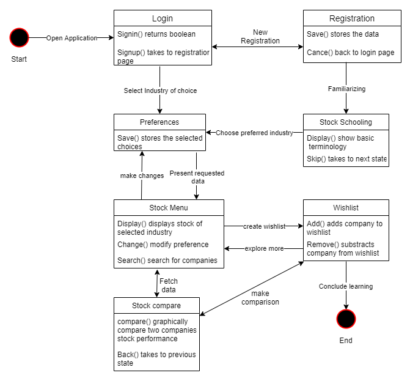
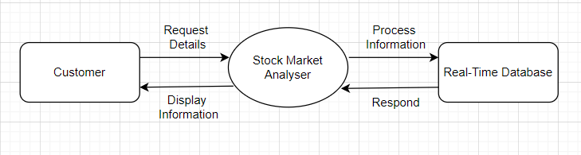

# Interestment: Simplified Stock Market Tracking and Education

Interestment is a comprehensive platform designed to empower beginning investors. By simplifying complex financial data and providing structured educational resources, it enables users to explore the stock market based on their personal interests.

## 🚀 Features

- **Personalized Onboarding**: Select sectors that interest you (e.g., Technology, Banks, Sports) to receive tailored stock suggestions.
- **Global Stock Search**: Real-time search for global stocks with performance data from the last five days.
- **Dynamic Watchlist**: Manage and track your favorite stocks in a centralized location.
- **Stock School**: A dedicated educational module to learn fundamental stock market terminology and concepts.
- **Secure Authentication**: Robust login and registration system with Firebase, including password recovery.
- **User Profile Management**: Customize your profile and update your investment interests at any time.

## 🛠 Technical Stack

- **Frontend**: HTML5, CSS3 (Bootstrap for responsive design), JavaScript (ES6+).
- **Backend & Database**: Firebase Authentication and Firestore (Cloud NoSQL database).
- **Data Source**: [Alpha Vantage API](https://www.alphavantage.co/) for real-time financial market data.

## 📂 Project Structure

The project follows a clean and organized structure for better maintainability:

```text
.
├── assets/
│   ├── css/        # Stylesheets for all application pages
│   ├── js/         # JavaScript logic and Firebase integration
│   └── images/     # Icons, banners, and architectural diagrams
├── index.html      # Landing page
├── home.html       # User dashboard with sector-based suggestions
├── search.html     # Global stock search functionality
├── watchlist.html  # Personalized stock tracking
├── schooling.html  # Educational resources (Stock School)
├── contact.html    # User feedback and support
├── profile.html    # User profile management
├── signup.html     # Registration and login interface
└── interest.html   # Interest selection page
```

## ⚙️ Installation & How to Run

1. **Clone the repository**:
   ```bash
   git clone https://github.com/dhruvpathak1/stock_market_project.git
   cd stock_market_project
   ```

2. **API Configuration**:
   - The application uses Alpha Vantage for stock data. You can obtain a free API key [here](https://www.alphavantage.co/support/#api-key).
   - In `home.html` and `assets/js/login.js`, update the `apiKey` variables with your personal key.

3. **Firebase Setup**:
   - The project is pre-configured with a demo Firebase project. For your own deployment, create a project at [Firebase Console](https://console.firebase.google.com/), enable Authentication and Firestore, and update the `firebaseConfig` object in the HTML and JS files.

4. **Running the App**:
   - Since this is a client-side application, you can simply open `index.html` in any modern web browser.
   - Alternatively, use a local development server like VS Code's "Live Server" for the best experience.

## 📊 System Architecture

The application's data flow and state management are well-documented:

| State Diagram | DFD Level 0 |
| :---: | :---: |
|  |  |

Detailed DFD Levels 1 and 2 are also available in the `assets/images/` directory.

## 📱 Mobile Support

An Android version (APK) is provided in the root directory for users who prefer a mobile experience.

---

*Interestment — Invest in your interest.*
